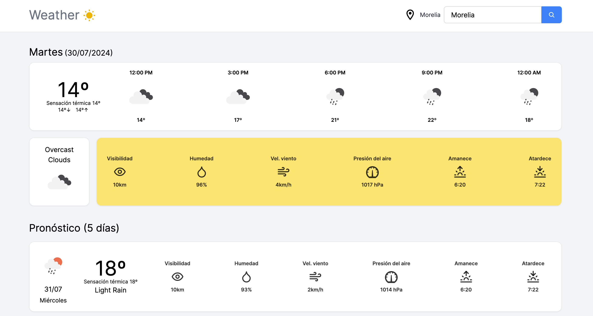
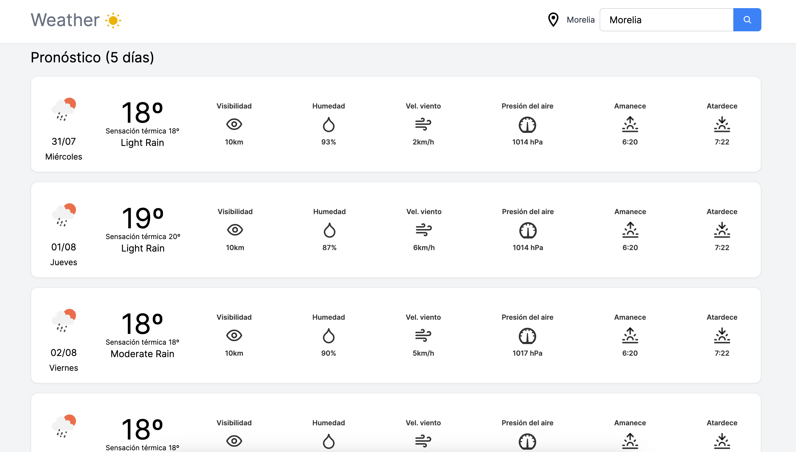

# Weather Forecast App 🌦️

## About

This app is designed to help users to compare the weather forecast for today and for the next 5 days across different destinations (US and MX only), aiding them in making informed decisions when reserving bus or flight tickets.

**Home**


**Forecast (5 days)**


You can see it alive [here](https://weather-app-iscasurs-projects.vercel.app/)

### Features

- **Weather Forecast Comparison**: Users can compare the weather forecast for the next 5 days, by day, for different destinations.
- **City Search**: Users can input the name of cities (US and MX only) and retrieve weather data for these locations.
- **Weather Data**: The app shows the maximum and minimum temperatures for the specified locations.
- **Geographic Coordinates**: The app uses geographic coordinates to look up temperatures via OpenWeather's API and shows the results in metric units.

## Technologies

- Nextjs
- Tailwind CSS
- Vercel

## Getting Started

If you want to run this project locally, you can:

1. Clone this project

```bash
git clone https://github.com/iscasur/weather-app.git
```

2. Go to the project's folder

```bash
cd weather-app
```

3. Install dependencies

```bash
npm install
# or
yarn install
# or
pnpm install
```

4. Set variables. You need to configure an API Key for [OpenWeather](https://openweathermap.org/). Create an `.env.local` file and add it into this file. 

```bash
NEXT_PUBLIC_WEATHER_KEY = YOUR_API_KEY
```

5. Run development environment

```bash
npm run dev
# or
yarn dev
# or
pnpm dev
```

Open [http://localhost:3000](http://localhost:3000) with your browser to see the result.

Or you can see it alive [here](https://weather-app-iscasurs-projects.vercel.app/).